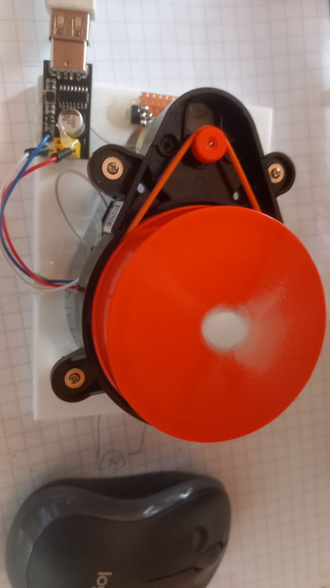
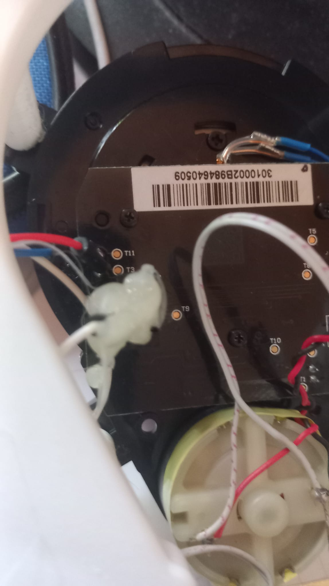

# Xiaomi_LDS01RR
Xiaomi LDS01RR LiDAR Library for Python
#Overview
This is a simple Lidar python library.

Special parts have been used here
 - Xiaomi LDS01RR
 - USB ESP8266 ESP-01 CH340G programmer
 - ams1117 voltage regulator
 - LDS01RR 3D box

##Two python files
  - restLirda.py it rest appi, make json file http://localhost:5000/api/lidar
  - Open3DView.py it maka Open3D view
   

# connection of terminals

| USB | LDS01RR |
|---|----|
| 0v | T11 |
| 3.3V | T3 | 
| RX | in the middle left connector, you can see three pins on the left if you look closely. |

Connect the ams1117 regulator USB 5v direct drive and take the wires to the motors, motor +3.3v (red and 0v (black)

