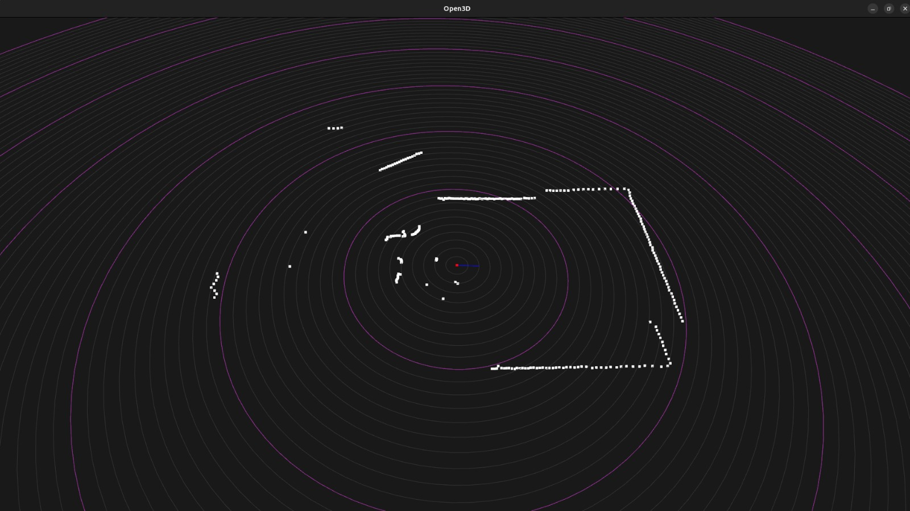
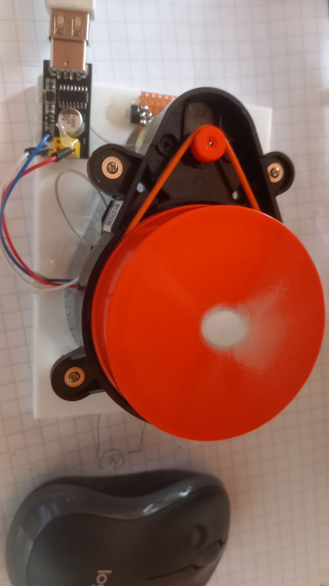
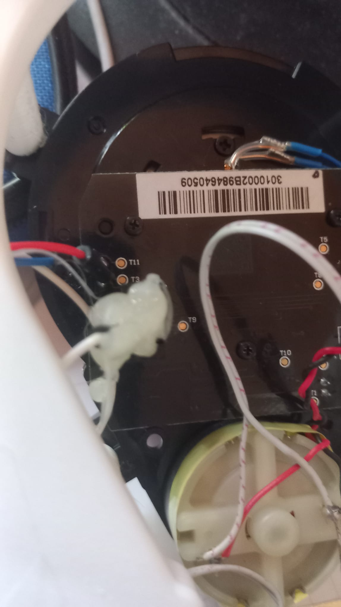
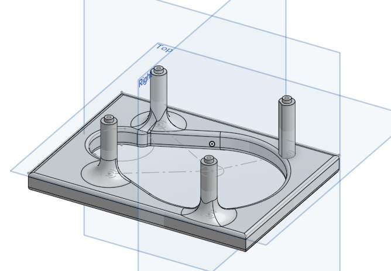

# Xiaomi_LDS01RR
Xiaomi LDS01RR LiDAR Library for Python

# Overview
This is a simple Lidar python library. The sensor provides 0-360 degrees measurement data and signal strength. In addition, the motor speed. The motor should rotate at a speed of 300 ppm, I have noticed that it is achieved with a voltage of 3.3v.

Special parts have been used here
 - Xiaomi LDS01RR
 - USB ESP8266 ESP-01 CH340G programmer
 - ams1117 voltage regulator (3.3v) 
 - LDS01RR 3D box

## Two python files
  - restLirda.py it rest appi, make json file http://localhost:5000/api/lidar
  - Open3DView.py it maka Open3D view


   


# Connection of terminals

| USB ESP8266 ESP-01 | LDS01RR |
|--------------------|----|
| 0v | T11 |
| 3.3V | T3 | 
| RX | in the middle left connector, you can see three pins on the left if you look closely. |

Connect the ams1117 regulator USB 5v direct drive and take the wires to the motors, motor +3.3v(red) and 0v (black)

|USB | ams1117 | LDS01RR motor |
|----|---------|-------|
| +5v | pin 3 |  |
| 0v | pin 1 | black |
| | pin 2 | red |




# 3d print file
[Stl file is here](3D%20printing%20files/Xiaomi%20Roborock%20Mi%20LDS02RR%20box.stl)

[It also find onShape](https://cad.onshape.com/documents/4dda02d38023ff990d877a00/w/ec7324818f246c720c5485a1/e/a38577bb8d45809ca89e4faa?renderMode=0&uiState=6866347f289a8956c2d673b2)



# install


Install the libraries first

``` bash
pip install requirements.txt
```
Check that the serial port name is the same (/dev/ttyUSB0)

``` bash
ls /dev/
```
Run python the file

``` bash
python Open3DView.py
```


